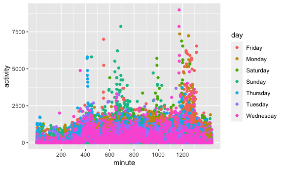

Homework 3
================
Ben Lebwohl

## Problem 1

Load the instacart dataset

``` r
library(tidyverse)
```

    ## ── Attaching packages ─────────────────────────────────────── tidyverse 1.3.1 ──

    ## ✓ ggplot2 3.3.5     ✓ purrr   0.3.4
    ## ✓ tibble  3.1.2     ✓ dplyr   1.0.7
    ## ✓ tidyr   1.1.3     ✓ stringr 1.4.0
    ## ✓ readr   1.4.0     ✓ forcats 0.5.1

    ## ── Conflicts ────────────────────────────────────────── tidyverse_conflicts() ──
    ## x dplyr::filter() masks stats::filter()
    ## x dplyr::lag()    masks stats::lag()

``` r
library(p8105.datasets)
library(patchwork)
data("instacart")

knitr::opts_chunk$set(
  fig.width = 6,
  fig.asp = 0.6,
  out.width = "90%")
```

*Write a short description of the dataset, noting the size and structure
of the data, describing some key variables, and giving illustrative
examples of observations.*

``` r
instacart
```

    ## # A tibble: 1,384,617 x 15
    ##    order_id product_id add_to_cart_order reordered user_id eval_set order_number
    ##       <int>      <int>             <int>     <int>   <int> <chr>           <int>
    ##  1        1      49302                 1         1  112108 train               4
    ##  2        1      11109                 2         1  112108 train               4
    ##  3        1      10246                 3         0  112108 train               4
    ##  4        1      49683                 4         0  112108 train               4
    ##  5        1      43633                 5         1  112108 train               4
    ##  6        1      13176                 6         0  112108 train               4
    ##  7        1      47209                 7         0  112108 train               4
    ##  8        1      22035                 8         1  112108 train               4
    ##  9       36      39612                 1         0   79431 train              23
    ## 10       36      19660                 2         1   79431 train              23
    ## # … with 1,384,607 more rows, and 8 more variables: order_dow <int>,
    ## #   order_hour_of_day <int>, days_since_prior_order <int>, product_name <chr>,
    ## #   aisle_id <int>, department_id <int>, aisle <chr>, department <chr>

``` r
view(instacart)
```

The data set is a tibble, with &gt;1.3 million observations and 14
columns. Each row is an order of a product. These come in batches of
orders (order\_id) and are tied to a user (user\_id). Each product is
associated with an aisle (aisle\_id) and department (department\_id)

Let’s see some of the more common departments and aisles that are
ordered:

``` r
instacart %>% 
  group_by(department, aisle) %>% 
  summarize(
    n_obs = n()
  ) %>% 
  arrange(desc(n_obs))
```

    ## `summarise()` has grouped output by 'department'. You can override using the `.groups` argument.

    ## # A tibble: 134 x 3
    ## # Groups:   department [21]
    ##    department aisle                          n_obs
    ##    <chr>      <chr>                          <int>
    ##  1 produce    fresh vegetables              150609
    ##  2 produce    fresh fruits                  150473
    ##  3 produce    packaged vegetables fruits     78493
    ##  4 dairy eggs yogurt                         55240
    ##  5 dairy eggs packaged cheese                41699
    ##  6 beverages  water seltzer sparkling water  36617
    ##  7 dairy eggs milk                           32644
    ##  8 snacks     chips pretzels                 31269
    ##  9 dairy eggs soy lactosefree                26240
    ## 10 bakery     bread                          23635
    ## # … with 124 more rows

*How many aisles are there, and which aisles are the most items ordered
from?*

``` r
instacart %>% 
  group_by(aisle) %>% 
  summarize(
    n_obs = n()
  ) %>% 
  arrange(desc(n_obs))
```

    ## # A tibble: 134 x 2
    ##    aisle                          n_obs
    ##    <chr>                          <int>
    ##  1 fresh vegetables              150609
    ##  2 fresh fruits                  150473
    ##  3 packaged vegetables fruits     78493
    ##  4 yogurt                         55240
    ##  5 packaged cheese                41699
    ##  6 water seltzer sparkling water  36617
    ##  7 milk                           32644
    ##  8 chips pretzels                 31269
    ##  9 soy lactosefree                26240
    ## 10 bread                          23635
    ## # … with 124 more rows

There are 134 aisles, and the aisles that most items are ordered from
are fresh vegetables and fresh fruits.

*Make a plot that shows the number of items ordered in each aisle,
limiting this to aisles with more than 10000 items ordered. Arrange
aisles sensibly, and organize your plot so others can read it.*

``` r
instacart %>% 
  group_by(aisle) %>% 
  summarize(
    n_obs = n()
  ) %>% 
  filter(n_obs >= 10000) %>% 
     mutate(aisle = fct_reorder(aisle, n_obs)) %>% 
  ggplot(aes(x = aisle, y = n_obs, label = aisle)) +
geom_point() +
scale_y_log10(breaks = c(20000, 40000, 60000, 80000, 100000, 150000), labels = c("20000", "40000", "60000", "80000", "100000", "150000")) +
  geom_text(aes(label=aisle, hjust = 0, vjust = 1), size = 3, check_overlap = TRUE) +
  theme(axis.title.x=element_blank(),
        axis.text.x=element_blank(),
        axis.ticks.x=element_blank()) +
  labs(
    y = "Number of orders" 
  )
```


*Make a table showing the three most popular items in each of the aisles
“baking ingredients”, “dog food care”, and “packaged vegetables fruits”.
Include the number of times each item is ordered in your table.*

``` r
instacart %>% 
  group_by(aisle, product_name) %>% 
  summarize(
    n_obs = n()
  ) %>% 
  mutate(
    order_rank = min_rank(-n_obs)
  ) %>% 
  filter(aisle == "baking ingredients" | aisle == "dog food care" | aisle == "packaged vegetables fruits") %>% 
  filter(order_rank <= 3) %>% 
  arrange(aisle, order_rank)
```

    ## `summarise()` has grouped output by 'aisle'. You can override using the `.groups` argument.

    ## # A tibble: 9 x 4
    ## # Groups:   aisle [3]
    ##   aisle                  product_name                           n_obs order_rank
    ##   <chr>                  <chr>                                  <int>      <int>
    ## 1 baking ingredients     Light Brown Sugar                        499          1
    ## 2 baking ingredients     Pure Baking Soda                         387          2
    ## 3 baking ingredients     Cane Sugar                               336          3
    ## 4 dog food care          Snack Sticks Chicken & Rice Recipe Do…    30          1
    ## 5 dog food care          Organix Chicken & Brown Rice Recipe       28          2
    ## 6 dog food care          Small Dog Biscuits                        26          3
    ## 7 packaged vegetables f… Organic Baby Spinach                    9784          1
    ## 8 packaged vegetables f… Organic Raspberries                     5546          2
    ## 9 packaged vegetables f… Organic Blueberries                     4966          3

*Make a table showing the mean hour of the day at which Pink Lady Apples
and Coffee Ice Cream are ordered on each day of the week; format this
table for human readers (i.e. produce a 2 x 7 table).*

``` r
instacart %>% 
  filter(product_name == "Pink Lady Apples" | product_name == "Coffee Ice Cream") %>% 
  group_by(product_name, order_dow) %>% 
  summarize(mean_hour = mean(order_hour_of_day)) %>% 
  pivot_wider(names_from = product_name, values_from = mean_hour)
```

    ## `summarise()` has grouped output by 'product_name'. You can override using the `.groups` argument.

    ## # A tibble: 7 x 3
    ##   order_dow `Coffee Ice Cream` `Pink Lady Apples`
    ##       <int>              <dbl>              <dbl>
    ## 1         0               13.8               13.4
    ## 2         1               14.3               11.4
    ## 3         2               15.4               11.7
    ## 4         3               15.3               14.2
    ## 5         4               15.2               11.6
    ## 6         5               12.3               12.8
    ## 7         6               13.8               11.9

## Problem 2

*Load, tidy, and otherwise wrangle the data. Your final dataset should
include all originally observed variables and values; have useful
variable names; include a weekday vs weekend variable; and encode data
with reasonable variable classes. Describe the resulting dataset
(e.g. what variables exist, how many observations, etc).*

``` r
accel_df =
read_csv("./data/accel_data.csv") %>% 
janitor::clean_names() %>% 
  pivot_longer(
    activity_1:activity_1440, 
    names_to = "minute", 
    names_prefix = "activity_", 
    values_to = "activity") %>% 
  mutate(
    type_of_day = ifelse(day == "Saturday" | day == "Sunday" , "weekend", "weekday")
  )
```

    ## 
    ## ── Column specification ────────────────────────────────────────────────────────
    ## cols(
    ##   .default = col_double(),
    ##   day = col_character()
    ## )
    ## ℹ Use `spec()` for the full column specifications.

``` r
accel_df %>% 
  group_by(day_id) %>% 
  summarize(n_obs = n())
```

    ## # A tibble: 35 x 2
    ##    day_id n_obs
    ##     <dbl> <int>
    ##  1      1  1440
    ##  2      2  1440
    ##  3      3  1440
    ##  4      4  1440
    ##  5      5  1440
    ##  6      6  1440
    ##  7      7  1440
    ##  8      8  1440
    ##  9      9  1440
    ## 10     10  1440
    ## # … with 25 more rows

The data set contains are 35 days, each with activity data on each of
the 1440 minutes of the day.

*Traditional analyses of accelerometer data focus on the total activity
over the day. Using your tidied dataset, aggregate accross minutes to
create a total activity variable for each day, and create a table
showing these totals. Are any trends apparent?*

``` r
accel_df %>% 
  group_by(day_id, type_of_day) %>% 
  summarize (total_activity = sum(activity)) %>% 
  ggplot(aes(x = day_id, y = total_activity, color = type_of_day)) +
  geom_point()
```

    ## `summarise()` has grouped output by 'day_id'. You can override using the `.groups` argument.


There is wide variability in activity! Weekends tend to have lower total
activity.

*Accelerometer data allows the inspection activity over the course of
the day. Make a single-panel plot that shows the 24-hour activity time
courses for each day and use color to indicate day of the week. Describe
in words any patterns or conclusions you can make based on this graph.*

``` r
accel_df %>% 
  mutate(
    minute = as.numeric(minute)
    )%>% 
  ggplot(aes(x = minute, y = activity, color = day)) +
  geom_point() +
   scale_x_continuous(
    breaks = c(200, 400, 600, 800, 1000, 1200),
    labels = c("200", "400", "600", "800", "1000", "1200")
   )
```



There are discrete times of day in which activity is consistently
increased.

## Problem 3

Load the NY NOAA data:

``` r
library(p8105.datasets)
data("ny_noaa")
ny_noaa
```

    ## # A tibble: 2,595,176 x 7
    ##    id          date        prcp  snow  snwd tmax  tmin 
    ##    <chr>       <date>     <int> <int> <int> <chr> <chr>
    ##  1 US1NYAB0001 2007-11-01    NA    NA    NA <NA>  <NA> 
    ##  2 US1NYAB0001 2007-11-02    NA    NA    NA <NA>  <NA> 
    ##  3 US1NYAB0001 2007-11-03    NA    NA    NA <NA>  <NA> 
    ##  4 US1NYAB0001 2007-11-04    NA    NA    NA <NA>  <NA> 
    ##  5 US1NYAB0001 2007-11-05    NA    NA    NA <NA>  <NA> 
    ##  6 US1NYAB0001 2007-11-06    NA    NA    NA <NA>  <NA> 
    ##  7 US1NYAB0001 2007-11-07    NA    NA    NA <NA>  <NA> 
    ##  8 US1NYAB0001 2007-11-08    NA    NA    NA <NA>  <NA> 
    ##  9 US1NYAB0001 2007-11-09    NA    NA    NA <NA>  <NA> 
    ## 10 US1NYAB0001 2007-11-10    NA    NA    NA <NA>  <NA> 
    ## # … with 2,595,166 more rows

This is a tibble with 2.59 million rows, containing data on
precipitation and temperature for various weather stations

``` r
ny_noaa %>% 
  group_by(id) %>% 
  summarize(n_obs = n())
```

    ## # A tibble: 747 x 2
    ##    id          n_obs
    ##    <chr>       <int>
    ##  1 US1NYAB0001  1157
    ##  2 US1NYAB0006   852
    ##  3 US1NYAB0010   822
    ##  4 US1NYAB0016   214
    ##  5 US1NYAB0017   459
    ##  6 US1NYAB0021   365
    ##  7 US1NYAB0022   273
    ##  8 US1NYAB0023   365
    ##  9 US1NYAB0025   215
    ## 10 US1NYAL0002   549
    ## # … with 737 more rows

``` r
ny_noaa %>% 
  summary()
```

    ##       id                 date                 prcp               snow       
    ##  Length:2595176     Min.   :1981-01-01   Min.   :    0.00   Min.   :  -13   
    ##  Class :character   1st Qu.:1988-11-29   1st Qu.:    0.00   1st Qu.:    0   
    ##  Mode  :character   Median :1997-01-21   Median :    0.00   Median :    0   
    ##                     Mean   :1997-01-01   Mean   :   29.82   Mean   :    5   
    ##                     3rd Qu.:2005-09-01   3rd Qu.:   23.00   3rd Qu.:    0   
    ##                     Max.   :2010-12-31   Max.   :22860.00   Max.   :10160   
    ##                                          NA's   :145838     NA's   :381221  
    ##       snwd            tmax               tmin          
    ##  Min.   :   0.0   Length:2595176     Length:2595176    
    ##  1st Qu.:   0.0   Class :character   Class :character  
    ##  Median :   0.0   Mode  :character   Mode  :character  
    ##  Mean   :  37.3                                        
    ##  3rd Qu.:   0.0                                        
    ##  Max.   :9195.0                                        
    ##  NA's   :591786

There appear to be \~1500 weather stations, with dates spanning from
1981 through 2010.

*Do some data cleaning. Create separate variables for year, month, and
day. Ensure observations for temperature, precipitation, and snowfall
are given in reasonable units. For snowfall, what are the most commonly
observed values? Why?*

``` r
ny_noaa =
ny_noaa %>% 
  mutate(
  year = lubridate::year(date),
  month = lubridate::month(date),
  day = lubridate::day(date),
  tmin = as.numeric(tmin) /10,
  tmax = as.numeric(tmax) /10
  ) %>% 
  relocate(id, year, month, day) %>% 
  select(-date)
```

``` r
ny_noaa %>% 
    group_by(snow) %>% 
  summarize(
    n_obs = n()
  ) %>% 
  mutate(
    order_rank = min_rank(-n_obs)
    )%>% 
      arrange(order_rank)
```

    ## # A tibble: 282 x 3
    ##     snow   n_obs order_rank
    ##    <int>   <int>      <int>
    ##  1     0 2008508          1
    ##  2    NA  381221          2
    ##  3    25   31022          3
    ##  4    13   23095          4
    ##  5    51   18274          5
    ##  6    76   10173          6
    ##  7     8    9962          7
    ##  8     5    9748          8
    ##  9    38    9197          9
    ## 10     3    8790         10
    ## # … with 272 more rows

For snowfall, the most commonly observed values are 0 and NA.

*Make a two-panel plot showing the average max temperature in January
and in July in each station across years. Is there any observable /
interpretable structure? Any outliers?*

``` r
  ny_noaa %>% 
  filter(month == 1 | month == 7) %>% 
  group_by(id, month) %>% 
  summarize(
    average_tmax = median(tmax, na.rm = TRUE)
  ) %>% 
  filter(average_tmax != "NaN") %>% 
ggplot(aes(x = average_tmax)) +
        geom_histogram() +
        facet_grid(. ~ month)
```

    ## `summarise()` has grouped output by 'id'. You can override using the `.groups` argument.

    ## `stat_bin()` using `bins = 30`. Pick better value with `binwidth`.


*Make a two-panel plot showing (i) tmax vs tmin for the full dataset
(note that a scatterplot may not be the best option); and (ii) make a
plot showing the distribution of snowfall values greater than 0 and less
than 100 separately by year.*

``` r
 plot_1 = ny_noaa %>% 
  ggplot(aes (x = tmin, y = tmax)) +
           geom_hex()

plot_2 = ny_noaa %>% 
  filter(snow <100 & snow >0) %>% 
  mutate(
    year = as.factor(year)
  ) %>% 
  ggplot(aes(y = snow)) +
  geom_boxplot() +
    facet_grid(. ~ year) +
    theme(axis.title.x=element_blank(),
        axis.text.x=element_blank(),
        axis.ticks.x=element_blank())

plot_1 / plot_2
```

    ## Warning: Removed 1136276 rows containing non-finite values (stat_binhex).


